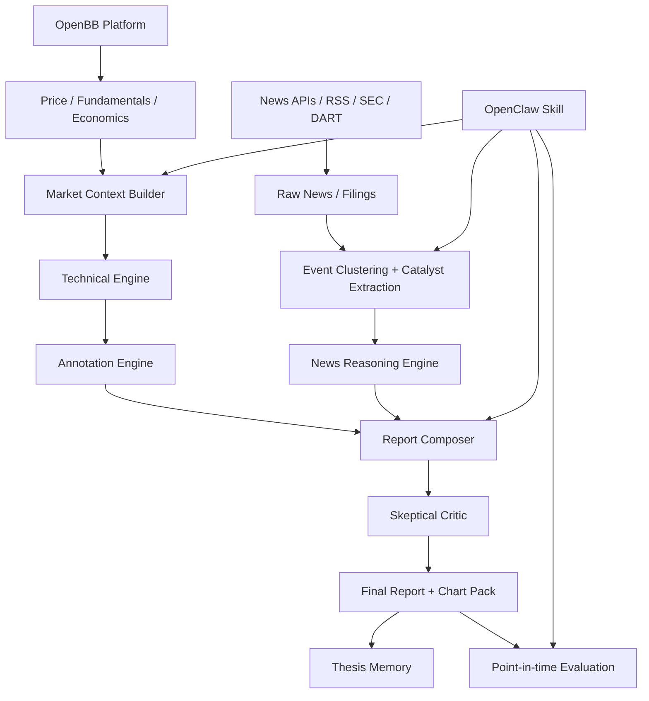

# System Architecture

## 1. 설계 철학

데이터 터미널을 재구현하지 않는다. OpenBB/Fincept가 이미 제공하는 데이터/터미널/차트 기능은 활용하고, 차별화 영역인 reasoning layer와 evaluation harness만 만든다.

## 2. 레이어별 책임

| 레이어 | 책임 | 재구현 금지 영역 |
|---|---|---|
| Data substrate | OpenBB/Fincept/provider에서 데이터 취득 | 가격 API, 기본 펀더멘털, 일반 indicator 라이브러리 |
| Market context | 수익률, 거래량, sector-relative move, volatility | provider abstraction |
| Technical engine | market structure, support/resistance, momentum, volume interpretation | raw chart terminal |
| News engine | dedup, event extraction, novelty, materiality, consensus gap | generic news search UI |
| Annotation engine | 차트 위에 해석 주석 배치 | interactive terminal 전체 |
| LLM analyst | catalyst -> driver -> scenario 논리 작성 | 수치 계산 |
| Critic | 과장, hallucination, priced-in 오류 탐지 | 최종 판단 자동 매매 |
| Evaluation | 과거 시점 성과 검증 | broker/execution |

## 3. Data flow

1. `UniverseResolver`: ticker/watchlist를 정규화한다.
2. `OpenBBAdapter`: OHLCV, fundamentals, sector/benchmark 데이터를 가져온다.
3. `NewsAdapter`: 뉴스/공시를 timestamp/source와 함께 가져온다.
4. `EventClusterer`: 중복 기사를 묶고 독립 event를 만든다.
5. `CatalystExtractor`: event를 business driver와 연결한다.
6. `TechnicalAnalyzer`: market structure와 indicator state를 계산한다.
7. `ChartAnnotator`: 주석 차트 렌더링용 annotation spec을 만든다.
8. `ReportComposer`: text report + chart pack을 생성한다.
9. `CriticAgent`: evidence gap, overclaim, stale source를 검토한다.
10. `Evaluator`: 예측 confidence와 실제 future return을 비교한다.

## 4. Output contracts

모든 중간 산출물은 JSON schema를 통과해야 한다.

- `technical_signal.schema.json`
- `catalyst_event.schema.json`
- `report.schema.json`

## 5. OpenClaw 역할

OpenClaw는 다음만 담당한다.

- skill command contract
- adapter orchestration
- prompt routing
- daily/session memory
- report artifact 저장
- evaluation command 실행

OpenClaw가 직접 price provider나 indicator engine을 재구현하면 바퀴 재발명이다.

## 6. Fincept 위치

Fincept는 desktop/terminal/workspace 성격이 강하므로 다음 용도로 둔다.

- UI/terminal layer 후보
- chart/research UX 참고
- 필요하면 generated report/chart를 Fincept workspace로 export

핵심 backend는 OpenBB + Python package + OpenClaw orchestration로 둔다.
