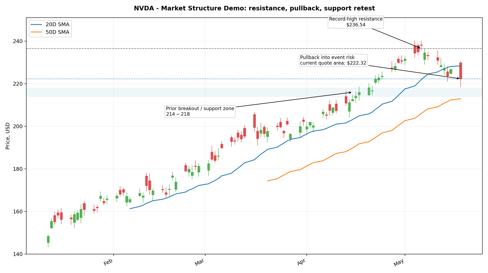
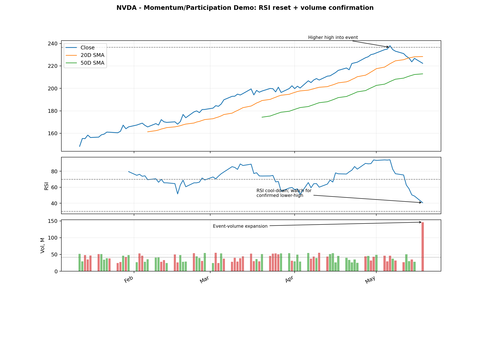
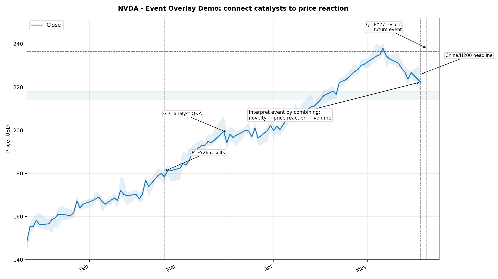

# NVDA Sample Deep-Dive Research Report

> **주의:** 이 샘플 리포트의 뉴스/시세/펀더멘털 파트는 2026-05-19 기준 공개 정보 기반 예시다. 차트 이미지는 현재 실행 환경에서 실시간 OHLCV를 내려받을 수 없어, NVDA의 실제 현재가/최근 고점 anchor를 반영한 synthetic OHLCV fixture로 생성한 **annotation demo**다. 실제 운용 시 동일 파이프라인이 OpenBB OHLCV로 차트를 다시 렌더링한다.

## 1. Executive Summary

| 항목 | 판단 |
|---|---|
| Ticker | NVDA |
| Report date | 2026-05-19 Asia/Seoul |
| Current quote anchor | USD 222.32, latest trade May 19 00:15 UTC |
| Overall label | **WATCH / Bullish catalyst, high event risk** |
| Time horizon | 5D event reaction + 20D swing |
| Confidence | 0.58 / 1.00 |
| Key risk | Earnings/guidance expectations already high; China approval uncertainty; event-volatility compression risk |

**Thesis:** NVDA still has a structurally bullish AI/data-center narrative, but the setup is not a clean low-risk entry. The next move is likely earnings-driven: headline beat alone may be insufficient because consensus expectations are already elevated. The most important variables are Q2 guidance, data-center revenue trajectory, gross margin, and China/H200 commentary.

## 2. Source-Aware Context

- NVIDIA reported Q4 FY2026 revenue of **$68.1B**, Data Center revenue of **$62.3B**, and FY2026 revenue of **$215.9B**. This confirms that the core business driver is still data-center AI infrastructure demand, not a minor segment effect. [NVIDIA Newsroom, 2026-02-25]
- NVIDIA is scheduled to report Q1 FY2027 results on **2026-05-20 2:00 PM PT**. [NVIDIA Investor Relations]
- Current quote anchor: **$222.32**, intraday high **$230.62**, intraday low **$218.55**, volume **146.3M**, market cap about **$5.44T**, P/E about **54.49**. [Market quote snapshot, 2026-05-19 UTC]
- Consensus previews cluster around very high expectations. One reported FactSet-based preview cited EPS **$1.75** and revenue **$78.85B**, with current-quarter expectations around EPS **$1.95** and revenue **$87.09B**. [Investor's Business Daily preview]
- Reuters reported that NVIDIA has U.S. licenses to sell H200 chips but had not received Chinese official approval as of 2026-05-18; Jensen Huang said he expects the market to open over time. [Reuters, 2026-05-18]

## 3. Annotated Chart Pack

### 3.1 Daily Market Structure

**Interpretation:**

- The chart marks the recent **record-high resistance around $236.54** and current quote zone near **$222.32**.
- The key technical question is not "is the company good?" but whether price can reclaim the prior high with volume after the earnings event.
- The **$214-$218 zone** is treated as a prior breakout/support band. A decisive loss of this band would turn the setup from constructive pullback into failed breakout risk.
- If the stock reclaims $236.54 on expanded volume, the market is likely treating guidance/commentary as materially better than expected.

\newpage

### 3.2 Momentum and Participation

**Interpretation:**

- Momentum cooled after a high-level push, which is normal before a binary earnings event.
- A cooled RSI is not automatically bearish. It becomes bearish if price fails near resistance while RSI makes a lower high and volume expands on down days.
- High volume near the event means the move after earnings will be more informative than pre-event drift.
- The ideal bullish structure is: price holds above support, RSI resets without breaking trend, and volume expands on the breakout candle.

\newpage

### 3.3 Event Overlay

**Interpretation:**

- The chart explicitly connects events to price reaction.
- Q4 FY2026 results validated the data-center growth thesis, but that is now part of market expectations.
- The 2026-05-18 China/H200 headline is potentially material, but incomplete because Chinese approval remained unresolved.
- The future Q1 FY2027 print is the next decisive information point.

\newpage

## 4. Technical Analysis

### 4.1 Market Structure

Current structure is **constructive but extended**. The broader trend remains positive because price is still near record-high territory, but the stock has pulled back from the recent high into an earnings event. This is a classic event-risk setup: trend strength is visible, but the next directional impulse requires confirmation.

### 4.2 Support / Resistance

| Level | Type | Why it matters |
|---:|---|---|
| $236.54 | Resistance / breakout trigger | Recent record-high anchor. A clean break suggests the market is repricing guidance or China optionality. |
| $222.32 | Current quote zone | Current price anchor; not a thesis level by itself. |
| $214-$218 | Support / failed-breakout test | Prior breakout and event-risk support band. Loss weakens the swing setup. |
| <$214 | Invalidation | Break below support implies bullish catalyst was either priced-in or rejected. |

### 4.3 Momentum

Momentum is not broken, but it is no longer a clean chase setup. A bullish reading requires one of the following:

1. RSI resets and price holds support.
2. MACD/short-term momentum turns upward after earnings.
3. Breakout above the prior high occurs with volume confirmation.

A bearish reading would be:

1. Lower high under $236.54.
2. RSI lower high.
3. Distribution volume.
4. Loss of $214-$218 support.

### 4.4 Volume / Participation

The current event zone has elevated participation. This makes post-event price action diagnostically valuable. If the stock rallies on high volume after the print, it implies fresh buyers are willing to underwrite already-high expectations. If the stock sells off despite good headline numbers, the likely interpretation is "good news was priced in."

## 5. News-to-Catalyst Analysis

| Catalyst | Direction | Driver | Novelty | Materiality | Priced-in risk | Interpretation |
|---|---|---|---:|---:|---|---|
| Q1 FY2027 earnings on 2026-05-20 | Mixed | Revenue, margin, guidance | 0.90 | 0.98 | High | The print is highly material, but expectations are elevated. Beat alone may not be enough. |
| Data Center growth from Q4 FY2026 | Positive | AI infrastructure revenue | 0.40 | 0.95 | High | Validates long-term thesis, but largely known. |
| China/H200 potential reopening | Positive optionality, uncertain | Incremental China revenue | 0.75 | 0.80 | Medium | U.S. license is constructive, but Chinese approval uncertainty prevents full catalyst confirmation. |
| Options/event volatility | Mixed/negative short-term | Positioning and implied move | 0.65 | 0.60 | Medium | Increases risk of sharp two-sided move; good for alerting, not sufficient for directional thesis. |
| Valuation at high P/E | Negative risk | Multiple compression | 0.30 | 0.75 | Medium | Raises bar for guidance and margin performance. |

## 6. Combined Interpretation

The integrated view is **bullish narrative, but not asymmetric unless guidance exceeds expectations or price confirms with breakout**.

- **Technical side:** price is near record-high resistance after a pullback; structure is constructive but vulnerable to failed-breakout behavior.
- **News side:** AI/data-center demand remains strong, but consensus already expects strong growth.
- **Catalyst side:** China/H200 optionality is potentially meaningful, but still unresolved.
- **Price reaction side:** if positive news does not reclaim $236.54, the market is likely saying the story is already priced in.

## 7. Scenario Analysis

| Scenario | Conditions | Expected price behavior | Confidence |
|---|---|---|---:|
| Bull case | Q1 beat + Q2 guide materially above consensus + constructive China commentary + volume breakout | Break above $236.54; continuation toward higher range | 0.32 |
| Base case | Q1 beat but guide around consensus; China remains unresolved | Chop between $214-$237; post-earnings fade possible | 0.43 |
| Bear case | Guidance/margin disappointment or China commentary weak; support loss | Break below $214-$218; failed-breakout risk | 0.25 |

## 8. Invalidation / Risk Controls

This research view weakens if:

- Price loses the $214-$218 support band after the print.
- Good headline results fail to generate sustained buying.
- Data-center growth or gross margin commentary disappoints relative to expectations.
- China/H200 commentary remains blocked or materially worsens.
- Broad AI trade reverses after Google I/O / NVDA earnings week.

## 9. Watchpoints

1. Q1 FY2027 earnings release: 2026-05-20 2:00 PM PT.
2. Q2 revenue guidance: whether the market reads it as merely "good" or actually "better than expected."
3. Data Center revenue and margin commentary.
4. China/H200 approval and revenue contribution language.
5. Breakout level: $236.54.
6. Support/invalidation: $214-$218.
7. Volume confirmation on the first full session after earnings.

## 10. Critic Memo

**Potential overclaim:** The long-term AI thesis is well known. A report should not treat familiar data-center growth as a new catalyst.

**Evidence gap:** Actual OHLCV chart should be regenerated from OpenBB in production. This sample chart is an annotation demo.

**Main uncertainty:** Whether high consensus and options positioning create a "sell the news" response despite strong reported numbers.

**Pass/Fail:** Pass as research memo format; production use requires live OHLCV/provider snapshot and post-earnings update.

## 11. Research-Only Disclaimer

This document is a research-assistance example. It is not investment advice, a recommendation, or an instruction to buy or sell securities.

## 12. Source Appendix

- NVIDIA Newsroom: Q4 FY2026 and fiscal 2026 results, 2026-02-25. https://nvidianews.nvidia.com/news/nvidia-announces-financial-results-for-fourth-quarter-and-fiscal-2026
- NVIDIA Newsroom/IR: Q1 FY2027 financial results event, 2026-05-20 2:00 PM PT. https://nvidianews.nvidia.com/news/nvidia-sets-conference-call-for-first-quarter-financial-results-6919947
- Market quote snapshot: NVDA, 2026-05-19 UTC, via finance snapshot.
- Investor's Business Daily: NVDA Q1 FY2027 earnings preview. https://www.investors.com/news/technology/nvidia-stock-investors-hold-their-breath-q1-report/
- Reuters: NVIDIA CEO on China market/H200 approval, 2026-05-18. https://www.reuters.com/world/china/nvidia-ceo-says-he-believes-china-market-will-open-over-time-2026-05-18/
